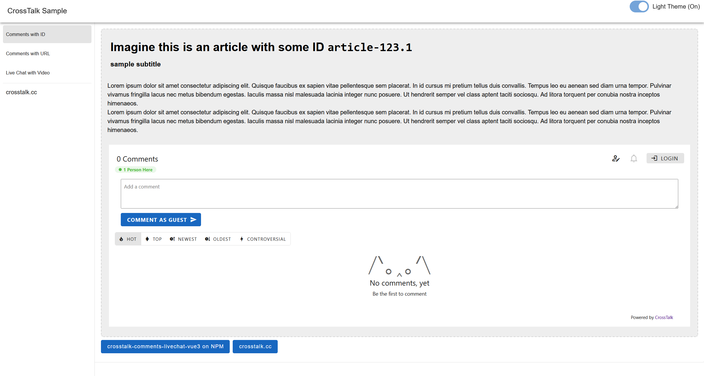
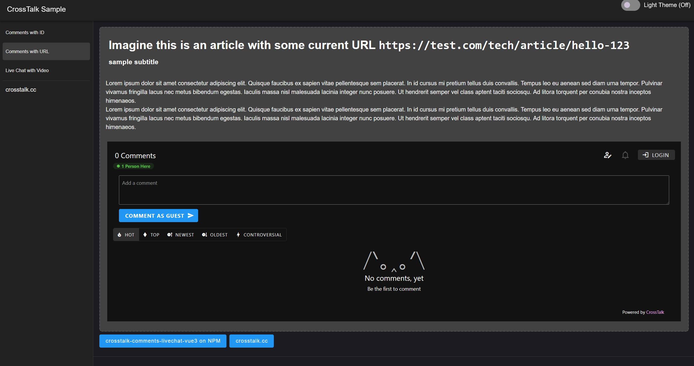
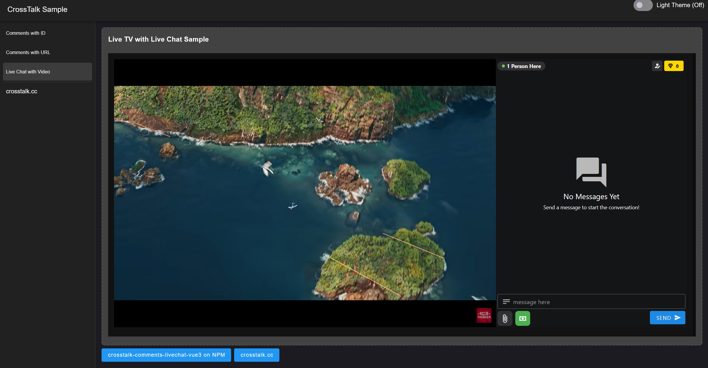

# CrossTalk Comments sample for Vue3
Sample code for using [CrossTalk Comments and Live Chat](https://crosstalk.cc) using [crosstalk-comments-livechat-vue3](https://www.npmjs.com/package/crosstalk-comments-livechat-vue3) NPM package with your Vue 3 based project

### Installation


```bash
npm i crosstalk-comments-livechat-vue3
```


### Runing the sample


```bash
npm run dev
```
If all worked well, the sample should be accessible at [localhost:5173](http://localhost:5173/)

### Information

This project uses the [crosstalk-comments-livechat-vue3](https://www.npmjs.com/package/crosstalk-comments-livechat-vue3) NPM package. This sample also uses Vuetify for beautification but it isn't a necessity for CrossTalk.

We use the `crosstalkDemo` sample web property name so the Project runs out of the box, you can sign up for [CrossTalk](https://crosstalk.cc)'s forever-free plan to create and use your own website or app's web property!

### Screenshots


[CrossTalk Comments](https://crosstalk.cc/comments) preview in `light` theme


[CrossTalk Comments](https://crosstalk.cc/comments) preview in `dark` theme


[CrossTalk Live Chat](https://crosstalk.cc/livechat) preview in `dark` theme
